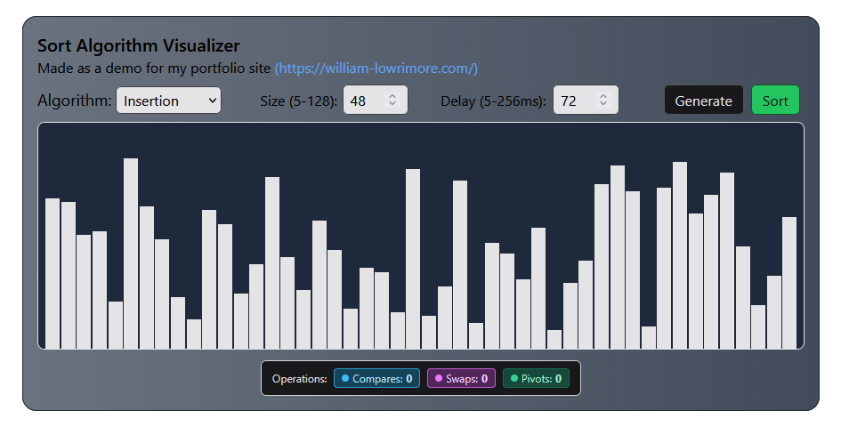

# Sort Algorithm Visualizer

An interactive sorting algorithm visualizer built with React + TypeScript.  
It animates how different sorting algorithms operate on an array of numbers and tracks comparisons/swaps for each sort

 

---

## Features

- **Interactive controls**
  - Choose algorithm: **Insertion, Bubble, Selection, Merge, Quick, Heap**
  - Adjust **array size** (within a fixed min/max range)
  - Adjust **animation delay**
  - **Generate** a new random array
  - Click **Sort** to sort using the chosen algorithm

- **Live statistics**
  - **Comparisons** – how many times two values were compared
  - **Swaps / Writes**
    - Merge sort: displays **writes** instead, since it doesn’t actually swap elements
  - **Pivots** – number of pivot selections used by Quick Sort

- **Random data generation**
  - Built-in random number generator creates a new array of values for testing
  - Size is controlled by the “Size” input, so you can see behavior on small vs large arrays

- **Animated bar visualization**
  - Operations are color-coded:
    - **Blue** – comparisons
    - **Pink** – swaps / writes (array changes)
    - **Green** – pivots (Quick Sort)
  - Bars animate smoothly so you can visually track the algorithm’s progress

---

## Algorithms

Currently implemented:

- **Insertion Sort**
- **Bubble Sort** (with early-exit optimization on already sorted arrays)
- **Selection Sort**
- **Merge Sort** (uses write operations instead of swaps)
- **Quick Sort** (uses pivots and pivot highlighting)
- **Heap Sort** (max-heap sort)

Each algorithm is implemented as a generator that yields **steps** (compare, swap, write, pivot, done).  
A shared sort engine takes in these steps, updates the array, and updates the visualization + statistics.
